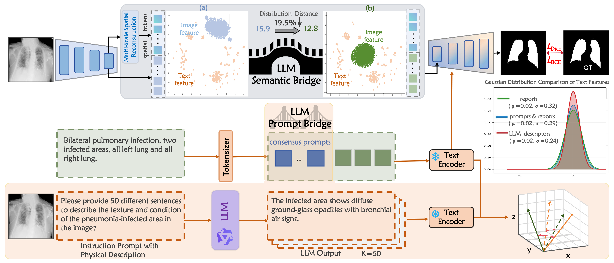

# MedBridge
The paper has been accepted by SPL.
# Abstract
Text-driven medical image segmentation aims to accurately
segment pathological regions in medical images based on
textual descriptions. Existing methods face two major challenges:
(a) The significant modality heterogeneity between textual and
visual features leads to inefficient cross-modal feature alignment;
(b) The insufficient utilization of medical shared knowledge
restricts semantic understanding. To address these challenges,
two large language model (LLM) bridges are constructed. LLM
semantic bridge leverages the sequential modeling capability of a
frozen LLM to reorganize visual features into semantically coherent
units that possess linguistic logic, thereby effectively bridging
vision and language. The LLM prompt bridge appends learnable
prompts, which encode medical shared knowledge from the LLM,
to text embeddings, thereby effectively bridging case-specificity
and medical consensus knowledge. Experimental results show the
predominant performance due to LLM participation.

# Code

通过网盘分享的文件：MedBridge
链接: https://pan.baidu.com/s/1s3cNTa31tXtZOzu3ePuvFw 提取码: kuv9 

# Cite

# Concact
liuzywen@ahu.edu.cn

